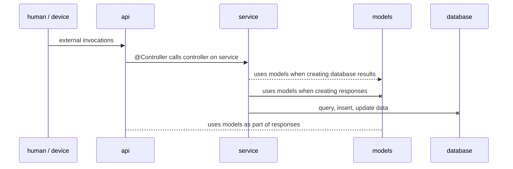

# WeThinkStore

springboot parent application containing 3 child modules, api, service, and models. api module exposing all secured REST services, models module containing all shared model objects and service module is the package with all implementations (possibly database integration, whatever...) 


### api

> 1. jwt security 
> 2. rest services 

### models 

> 1. all database table model objects 

### service

> 1. database integration (dao's) 
> 2. controller for api 

## Build

> mvn clean verify compile 

## Run

> mvn (WIP) 


## Dependency 

The structure of the modules are wired like : 

```
